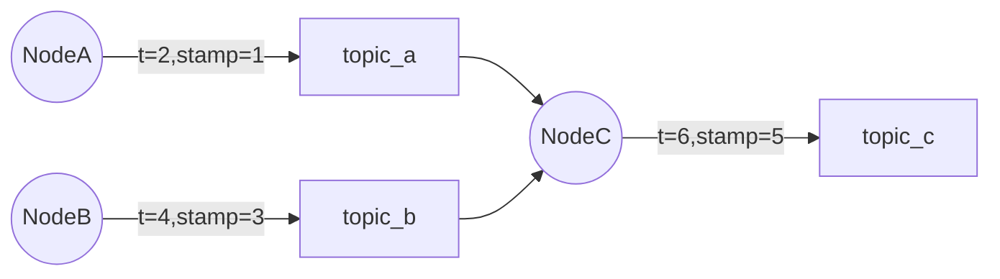
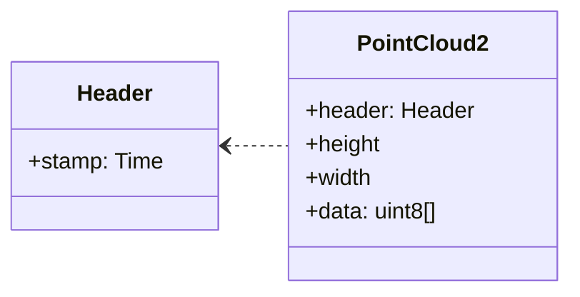
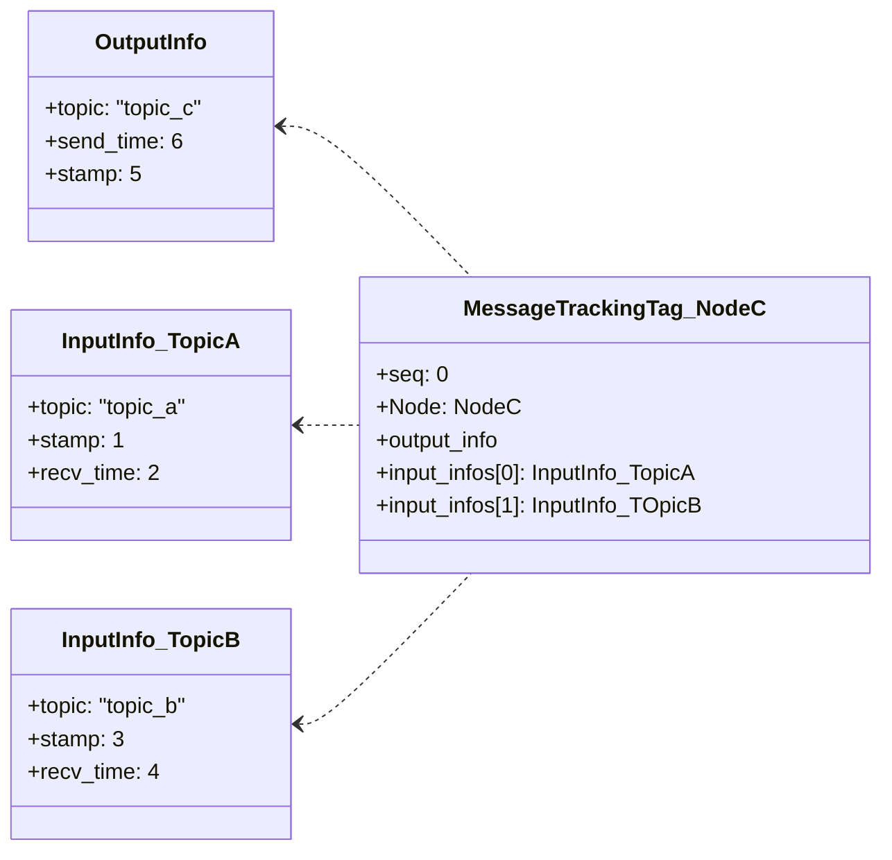
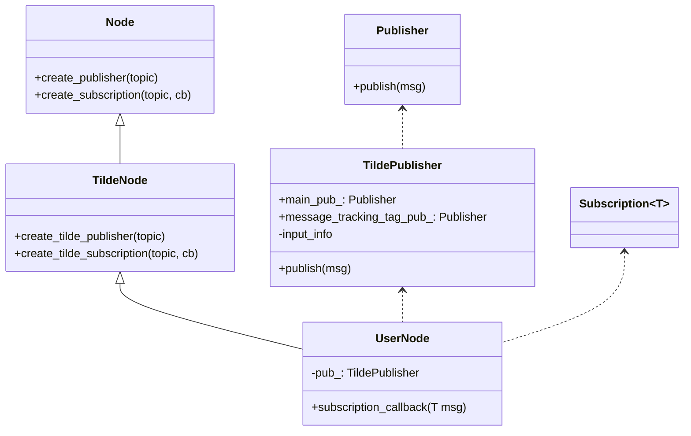
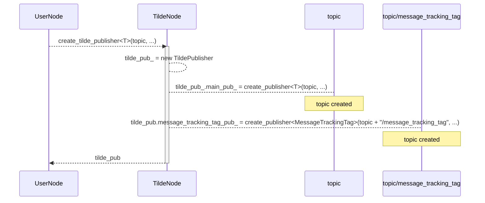
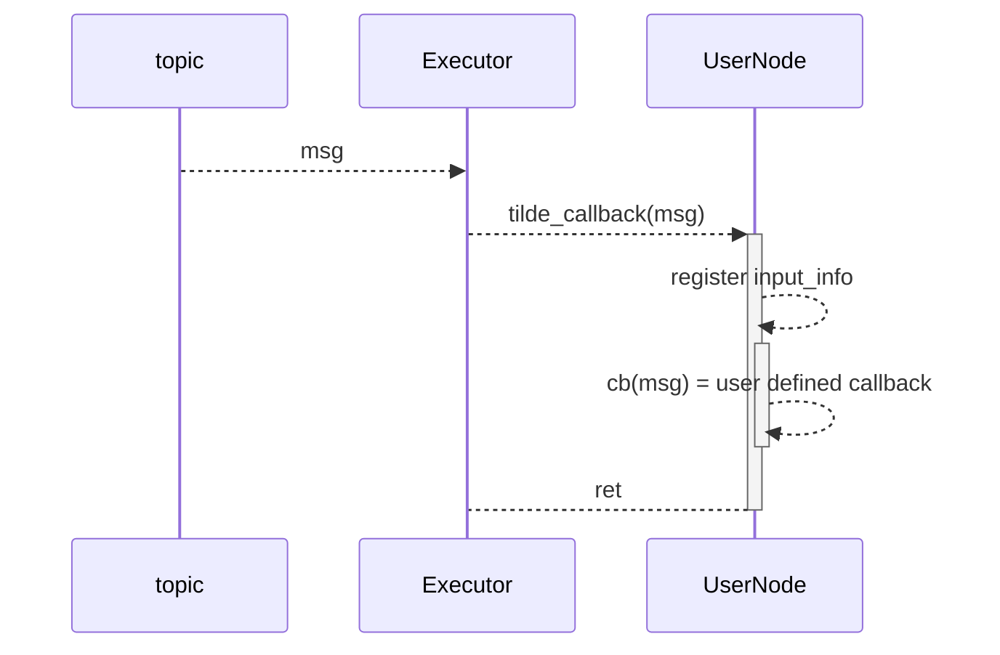
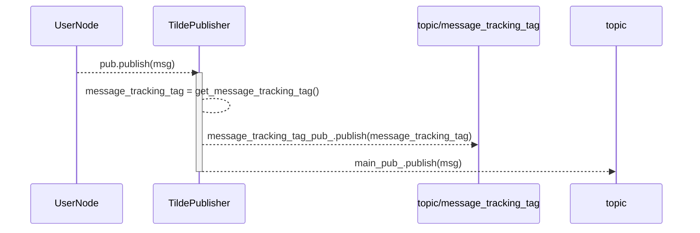

# TILDE の動作原理

**best viewed with [mermaid-diagrams](https://chrome.google.com/webstore/detail/mermaid-diagrams/phfcghedmopjadpojhmmaffjmfiakfil/related) or [GitHub + Mermaid](https://chrome.google.com/webstore/detail/github-+-mermaid/goiiopgdnkogdbjmncgedmgpoajilohe)**

TILDE は、ユーザプログラムがメイントピックを publish するのに併せて MessageTrackingTag というトピックを `<topic名>/message_tracking_tag` に publish します。  
MessageTrackingTag は数百バイト程度のメッセージで、メイントピックを構成する入力トピックの情報が記載されます。

ここで **メイントピック** とはアプリケーションが本来やりとりするメッセージです。
TILDE が MessageTrackingTag という付加的なトピックをやりとりする為、アプリケーション本来のメッセージをメイントピックと呼称しています。

<!-- markdown-toc start - Don't edit this section. Run M-x markdown-toc-refresh-toc -->

## Table of Contents

- [TILDE の動作原理](#tilde-の動作原理)
  - [Table of Contents](#table-of-contents)
  - [MessageTrackingTag](#message_tracking_tag)
  - [例](#例)
    - [DAG と動作概要](#dag-と動作概要)
    - [stamp](#stamp)
    - [NodeC の MessageTrackingTag](#nodec-の-message_tracking_tag)
  - [MessageTrackingTag の作成メカニズム](#message_tracking_tag-の作成メカニズム)
    - [概要](#概要)
    - [class](#class)
    - [create_tilde_publisher](#create_tilde_publisher)
    - [create_tilde_subscription](#create_tilde_subscription)
    - [publish](#publish)
  - [Explicit API](#explicit-api)
  - [オーバーヘッド](#オーバーヘッド)

<!-- markdown-toc end -->

まず MessageTrackingTag についてデータ構造と例を記述します。
次に TILDE が MessageTrackingTag を作る仕組みを記述します。
最後にオーバーヘッドについて記載します。

## MessageTrackingTag

MessageTrackingTag はメイントピックの publish 時と同時に送信されるメタ情報です。
`<メイントピック名>/message_tracking_tag` に送信されます。

メッセージ定義は以下の通りです。
※ TODO: ファイル名やデータ構造はリファクタ予定

[MessageTrackingTag.msg](../src/tilde_msg/msg/MessageTrackingTag.msg)

- Header:
  - header
  - シーケンス番号
  - 送信者情報(node 名や publisher ID)
- `output_info`: 出力トピックに関する情報
  - トピック名: メイントピックのトピック名
  - header stamp: メイントピックの header stamp
  - 送信時刻: メイントピックの送信時刻
- `input_infos`: 入力トピックに関する情報。下記を入力トピック分。
  - トピック名: メイントピックのトピック名
  - header stamp: メイントピックの header stamp
  - 受信時刻: メイントピックの受信時刻

トピック名やノード名の長さにもよりますがデータサイズは以下の通りです。送信周波数はメイントピックと同じです。

- Header + output_info: 約 80 バイト + トピック名やノード名分のバイト数
- input_infos: (入力トピック数 \* 約 40 バイト) + トピック名のバイト数

## 例

### DAG と動作概要

NodeA, NodeB, NodeC からなる以下の DAG を考えます(丸はノード、四角はトピック)。



- 動作概要
  - NodeA は t=2 に、NodeB は t=4 に publish します。
  - NodeC は t=6 に起床し、これらの情報を元に自身の計算をして topic_c を送信します。
- 補足
  - 矢印中の stamp は次に示す通り ros2 std_msgs::msg::Header の stamp フィールドです。
  - メッセージ識別に利用します。

### stamp

各 Node では ros2 の sensor_msgs やアプリケーション固有のメッセージ型を送信します。
例えば `sensor_msgs/msg/PointCloud2` の場合、以下の様なメッセージになります(説明の為フィールドは省略しています)。



ROS2 のセンサーやナーゲーションで用いられるメッセージでは標準的に header フィールドが付与されています。
header フィールドには stamp フィールドがあり、ユーザ定義のタイムスタンプを記入します。
TILDE では **header フィールドの stamp を利用** によりメッセージを識別します。

### NodeC の MessageTrackingTag

TILDE はメインメッセージの publish をフックして MessageTrackingTag を送信します。
NodeC の出力する MessageTrackingTag は以下の様な物になります(フィールドは一部省略しています)。



この様に MessageTrackingTag には **Node 単位で、出力と入力の紐付け情報** が記載されます。
より具体的には **送信したメインメッセージと、自身が subscription している入力トピックのメッセージを header stamp で紐付け** ます。
上記の様に、デフォルトではメッセージの紐付けは各入力トピックについて **メインメッセージ送信前に受信した最新のメッセージ** になっています。 explicit API により明示的に紐付け情報を設定することが可能です。

## MessageTrackingTag の作成メカニズム

MessageTrackingTag はメイントピックの publish 時に同時に送信されます。
また `input_infos` では入力トピックとの紐付け情報が設定されます。

これらを行なうためには subscription 時に `input_infos` 用の情報を保持したり、 MessageTrackingTag のメッセージを作成・送信する必要がありますが、TILDE が publish や subscription callback をフックしてこれらの処理を実行する為、アプリケーションでこれらを意識する必要はありません。

### 概要

以下で UML 風の図を用いて TILDE の動作概要を記述します。先に簡単に言葉でまとめます。

- アプリケーションから見た TILDE
  - MessageTrackingTag を作成するのに必要な情報の蓄積や MessageTrackingTag の送信は TILDE が行なう。
  - その為、基本的にはアプリケーションで TILDE や MessageTrackingTag のことを考える必要はない。
  - ただし内部でバッファリングしている場合、メッセージを正しくトラッキングするには input_info を明示的に登録する必要がある
- MessageTrackingTag の作成
  - TILDE のカスタム create_publisher によりカスタムの Publisher である TildePublisher が作成される。
  - TildePublisher は入力情報に関するデータを持っている。
  - メイントピックの publish をフックし、メイントピックを送信すると同時に入力情報データから MessageTrackingTag を作成して MessageTrackingTag を送信する。
- input infos の紐付け
  - TILE のカスタム create_subscription により subscription コールバックがフックされる。
  - フック中の処理で TildePublisher に対して入力トピックや header stamp などの情報を登録する。

### class

TILDE では以下のクラス・API を提供します。

- rclcpp::Node や rclcpp::Publisher に相当する TildeNode や TIldePublisher
- `create_publisher` や `create_subscription` の TILDE カスタム版
- いずれもクラス名・関数名が異なることを除けば ROS2 のものと同じシグニチャです。よって機械的変換で組み込むことができます。



### create_tilde_publisher

`create_tilde_publisher<T>(topic, ...)` によりメインメッセージと MessageTrackingTag 用の publisher が作成されます。
MessageTrackingTag 用のトピック名はメイントピック名に `/message_tracking_tag` という接尾語がついたものです。



`create_tilde_publisher` の返り値は rclcpp::Publisher ではなく TildePublisher です。

### create_tilde_subscription

`create_tilde_subscription<T>(topic, qos, cb)` により Subscription が作成されます。
TILDE では subscription callback をフックする為、ユーザ指定のコールバック関数 cb を TILDE 用のコールバック関数でラップした新たなコールバック関数を登録します。

疑似コードで記載すると以下の様になります。

```cpp
void create_tilde_subscription<T>(topic, qos, cb) {
  auto tilde_cb = [this, topic, cb](T msg) {
     // MessageTrackingTag 用に入力情報の紐付け
     auto sub_time = now();
     this->tilde_pub.set_input_info(
        topic,
        sub_time,
        msg.header.stamp);

     // cb の呼び出し
     cb(msg);
  };

  return this->create_subscription<T>(topic ,qos, tilde_cb);
}
```

subscription 時の動作は以下の通りです。
subscription 時に TildePublisher の input_info 情報を登録します。



### publish

TildePublisher は登録済みの `input_info` を参照して MessageTrackingTag を作成します。
MessageTrackingTag とメインメッセージを送信します。



## Explicit API

[NodeC の MessageTrackingTag](#nodec-の-message_tracking_tag) では「メインメッセージ送信前に受信した最新のメッセージ」に紐付けられると記述しました。
受信メッセージを内部でバッファして選択的に利用している、あるいは入力トピックが複数ありそれぞれバッファリングしている等、入力トピックと出力トピックが明示的に紐付かないノードでは explicit API を使って明示的に紐付け情報を設定することが可能です。

下図は 4 入力、 1 出力のノードの例です。
それぞれの入力はバッファされ publish 時に選択的に利用されます。
この図では `/left` は L1-L3 の 3 世代あり、 L2 が使われています。

```text
             入力をバッファ    callback の中でバッファの中から
                      利用するデータを選択
               buffer       +- callback-+
/left    -->  L1 L2 L3  ->  | L2        |
                            |           |
/right   -->  R1 R2     ->  | R1        |  --> /concatenate
                            |           |
/top     -->  T1 T2 T3  ->  | T2        |
                            |           |
/twist   -->  W1 W2 W3  ->  | W2 W3     |
                            +-----------+
              ^
              TILDE では「最も最近受信した stamp」しか覚えていない為、正確な MessageTrackingTag を作成できない
```

Explicit API では「`/concatenate` を作成するのに `/left` の L2、`/right` の R1 (以下略)を使った」という指定ができます。

## オーバーヘッド

※ TODO: 大体以下を記載する。

- TILDE 有無時のオーバヘッド
  - autoware か demo システムを対象に TILDE 適用有無時のベンチマーク結果を記載する
  - CPU 利用率やネットワーク帯域など ← リソース分析で検討しているプロセスリソースモニタリングツールが使える?
