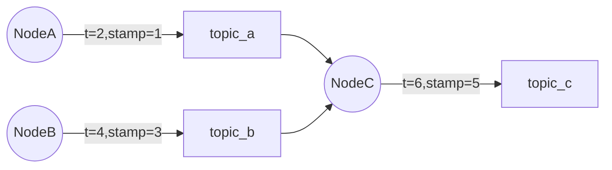
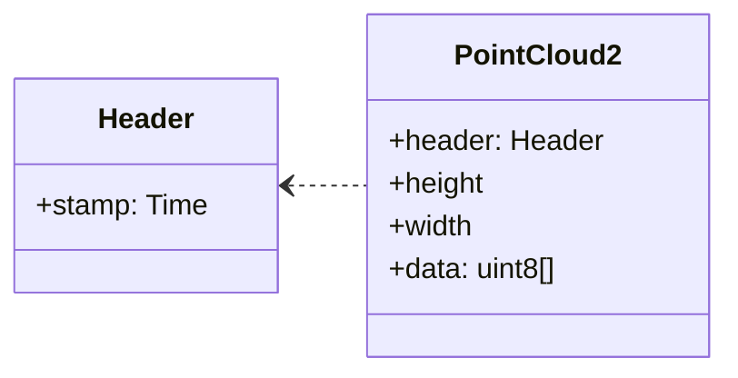
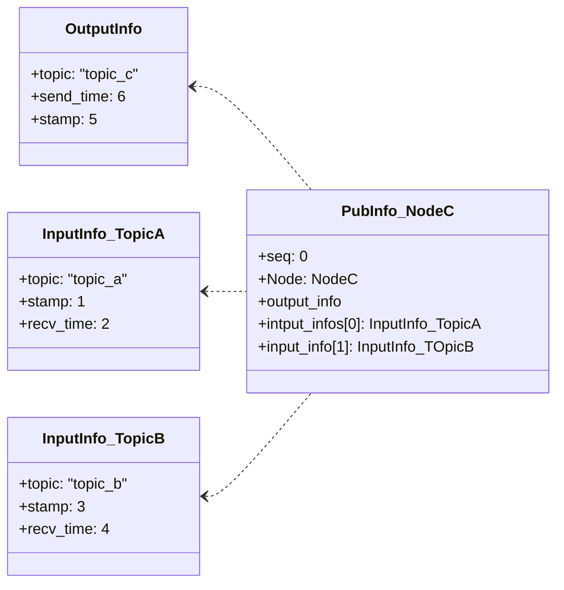
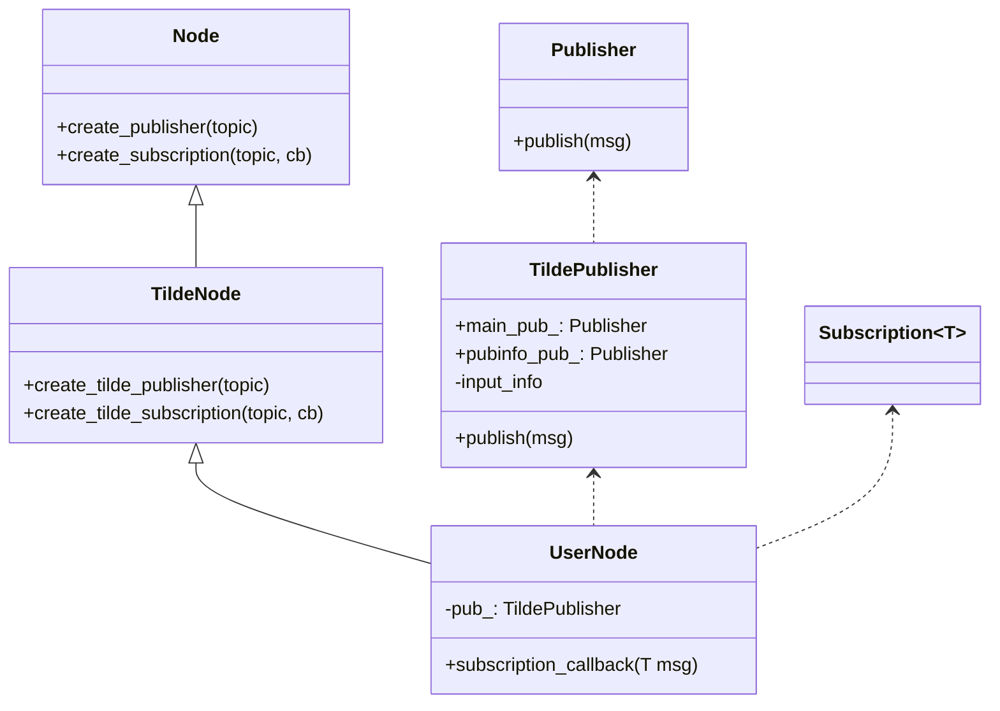
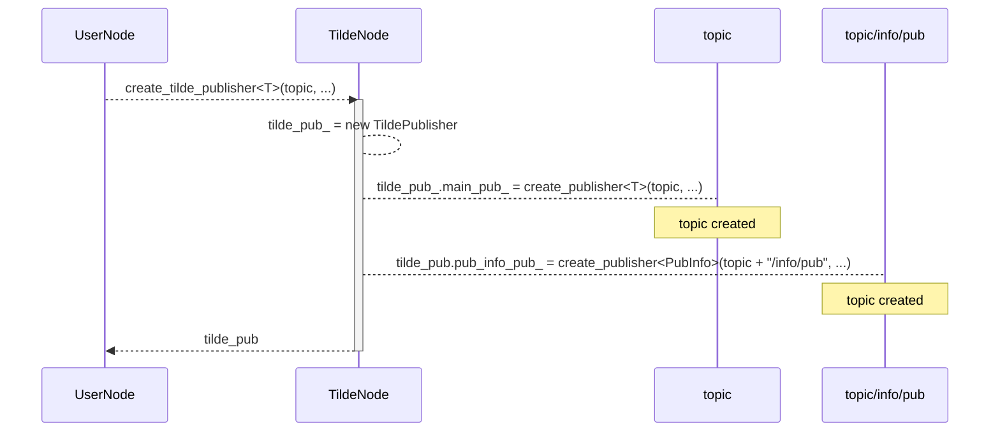
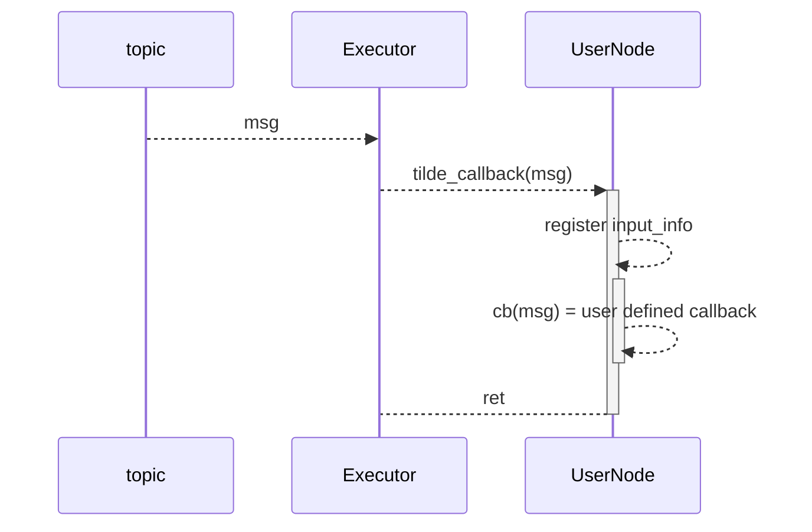
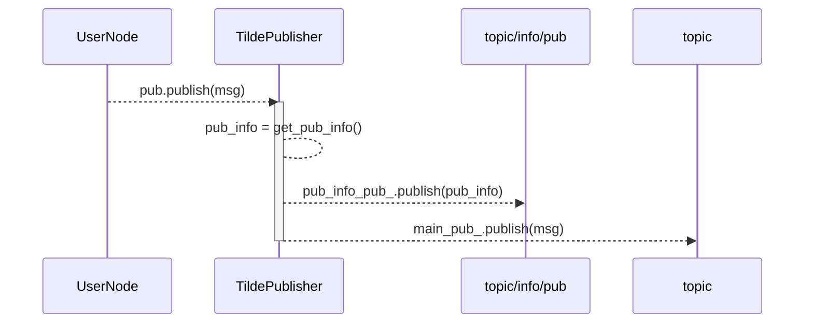

TILDE の動作原理
===

**best viewed with [mermaid-diagrams](https://chrome.google.com/webstore/detail/mermaid-diagrams/phfcghedmopjadpojhmmaffjmfiakfil/related) or [GitHub + Mermaid](https://chrome.google.com/webstore/detail/github-+-mermaid/goiiopgdnkogdbjmncgedmgpoajilohe)**

TILDE ではメイントピックの publish 時に PubInfo というメッセージを `<topic名>/info/pub` に publish します。  
PubInfo は数百バイト程度のメッセージで、メイントピックを構成する入力トピックの情報が記載されます。  

ここで **メイントピック** とはアプリケーションが本来やりとりするメッセージです。
TILDE が PubInfo という付加的なトピックをやりとりする為、アプリケーション本来のメッセージをメイントピックと呼称しています。

<!-- markdown-toc start - Don't edit this section. Run M-x markdown-toc-refresh-toc -->
**Table of Contents**

- [TILDE の動作原理](#tilde-の動作原理)
    - [PubInfo](#pubinfo)
    - [例](#例)
        - [DAG と動作概要](#dag-と動作概要)
        - [stamp](#stamp)
        - [NodeC の PubInfo](#nodec-の-pubinfo)
    - [PubInfo の作成メカニズム](#pubinfo-の作成メカニズム)
        - [概要](#概要)
        - [class](#class)
        - [create_tilde_publisher](#create_tilde_publisher)
        - [create_tilde_subscription](#create_tilde_subscription)
        - [publish](#publish)
    - [オーバーヘッド](#オーバーヘッド)

<!-- markdown-toc end -->

まず PubInfo についてデータ構造と例を記述します。
次に TILDE が PubInfo を作る仕組みを記述します。
最後にオーバーヘッドについて記載します。

## PubInfo

PubInfo はメイントピックの publish 時と同時に送信されるメタ情報です。
`<メイントピック名>/info/pub` に送信されます。

メッセージ定義は以下の通りです。
※ TODO: ファイル名やデータ構造はリファクタ予定

[PubInfo.msg](../src/path_info_msg/msg/PubInfo.msg)

- Header:
  - header 
  - シーケンス番号
  - 送信者情報(node 名や publisher ID)
- `output_info`: 出力トピックに関する情報
  - トピック名: メイントピックのトピック名
  - header stamp: メイントピックの header stamp
  - 送信時刻: メイントピックの送信時刻
- `input_infos`: 入力トピックに関する情報。下記を入力トピック分。
  - トピック名: メイントピックのトピック名
  - header stamp: メイントピックの header stamp
  - 受信時刻: メイントピックの受信時刻

トピック名やノード名の長さにもよりますがデータサイズは以下の通りです。送信周波数はメイントピックと同じです。

- Header + output_info: 約 80 byte + トピック名やノード名分のバイト数
- input_infos: 入力トピック一件あたり約 40 byte + トピック名のバイト数

## 例

### DAG と動作概要

NodeA, NodeB, NodeC からなる以下の DAG を考えます(丸はノード、四角はトピック)。



- 動作概要
  - NodeA は t=2 に、NodeB は t=4 に publish します。
  - NodeC は t=6 に起床し、これらの情報を元に自身の計算をして topic_c を送信します。
- 補足
  - 矢印中の stamp は次に示す通り ros2 std_msgs::msg::Header の stamp フィールドです。
  - メッセージ識別に利用します。

### stamp

各 Node では ros2 の sensor_msgs やアプリケーション固有のメッセージ型を送信します。
例えば `sensor_msgs/msg/PointCloud2` の場合、以下の様なメッセージになります(説明の為フィールドは省略しています)。



ROS2 のセンサーやナーゲーションで用いられるメッセージでは標準的に header フィールドが付与されています。
header フィールドには stamp フィールドがあり、ユーザ定義のタイムスタンプを記入します。
TILDE では **header フィールドの stamp を利用** によりメッセージを識別します。

### NodeC の PubInfo

TILDE はメインメッセージの publish をフックして PubInfo を送信します。
NodeC の出力する PubInfo は以下の様な物になります(フィールドは一部省略しています)。



この様に PubInfo には **Node 単位で、出力と入力の紐付け情報** が記載されます。
より具体的には **送信したメインメッセージと、自身が subscription している入力トピックのメッセージを header stamp で紐付け** ます。
上記の様に、デフォルトではメッセージの紐付けは各入力トピックについて **メインメッセージ送信前に受信した最新のメッセージ** になっています。 explicit API により明示的に紐付け情報を設定することが可能です。

## PubInfo の作成メカニズム

PubInfo はメイントピックの publish 時に同時に送信されます。
また `input_infos` では入力トピックとの紐付け情報が設定されます。

これらを行なうためには subscription 時に `input_infos` 用の情報を保持したり、 PubInfo のメッセージを作成・送信する必要がありますが、TILDE が publish や subscription callback をフックしてこれらの処理を実行する為、アプリケーションでこれらを意識する必要はありません。

### 概要

以下で UML 風の図を用いて TILDE の動作概要を記述します。先に簡単に言葉でまとめます。

- アプリケーションから見た TILDE
  - PubInfo を作成するのに必要な情報の蓄積や PubInfo の送信は TILDE が行なう。
  - その為、基本的にはアプリケーションで TILDE や PubInfo のことを考える必要はない。
  - ただし内部でバッファリングしている場合、メッセージを正しくトラッキングするには input_info を明示的に登録する必要がある
- PubInfo の作成
  - TILDE のカスタム create_publisher によりカスタムの Publisher である TildePublisher が作成される。
  - TildePublisher は入力情報に関するデータを持っている。
  - メイントピックの publish をフックし、メイントピックを送信すると同時に入力情報データから PubInfo を作成してPubInfo を送信する。
- input infos の紐付け
  - TILE のカスタム create_subscription により subscription コールバックがフックされる。
  - フック中の処理で TildePublisher に対して入力トピックや header stamp などの情報を登録する。

### class

TILDE では以下のクラス・API を提供します。

- rclcpp::Node や rclcpp::Publisher に相当する TildeNode や TIldePublisher
- `create_publisher` や `create_subscription` の TILDE カスタム版
- いずれもクラス名・関数名が異なることを除けば ROS2 のものと同じシグニチャです。よって機械的変換で組み込むことができます。



### create_tilde_publisher


`create_tilde_publisher<T>(topic, ...)` によりメインメッセージと PubInfo 用の publisher が作成されます。
PubInfo 用のトピック名はメイントピック名に `/info/pub` という接尾語がついたものです。



`create_tilde_publisher` の返り値は rclcpp::Publisher ではなく TilderPublisher です。

### create_tilde_subscription

`create_tilde_subscription<T>(topic, qos, cb)` により Subscription が作成されます。
TILDE では subscription callback をフックする為、ユーザ指定のコールバック関数 cb を TILDE 用のコールバック関数でラップした新たなコールバック関数を登録します。

疑似コードで記載すると以下の様になります。

``` cpp
void create_tilde_subscription<T>(topic, qos, cb) {
  auto tilde_cb = [this, topic, cb](T msg) {
     // PubInfo 用に入力情報の紐付け
     auto sub_time = now();
     this->tilde_pub.set_input_info(
        topic,
        sub_time, 
        msg.header.stamp);

     // cb の呼び出し
     cb(msg);
  };

  return this->create_subscription<T>(topic ,qos, tilde_cb);
}
```

subscription 時の動作は以下の通りです。
subscription 時に TildePublisher の input_info 情報を登録します。



### publish

TildePublisher は登録済みの `input_info` を参照して PubInfo を作成します。
PubInfo とメインメッセージを送信します。



## オーバーヘッド

※ TODO: 大体以下を記載する。

- TILDE 有無時のオーバヘッド
  - autoware か demo システムを対象に TILDE 適用有無時のベンチマーク結果を記載する
  - CPU 利用率やネットワーク帯域など ← リソース分析で検討しているプロセスリソースモニタリングツールが使える?
