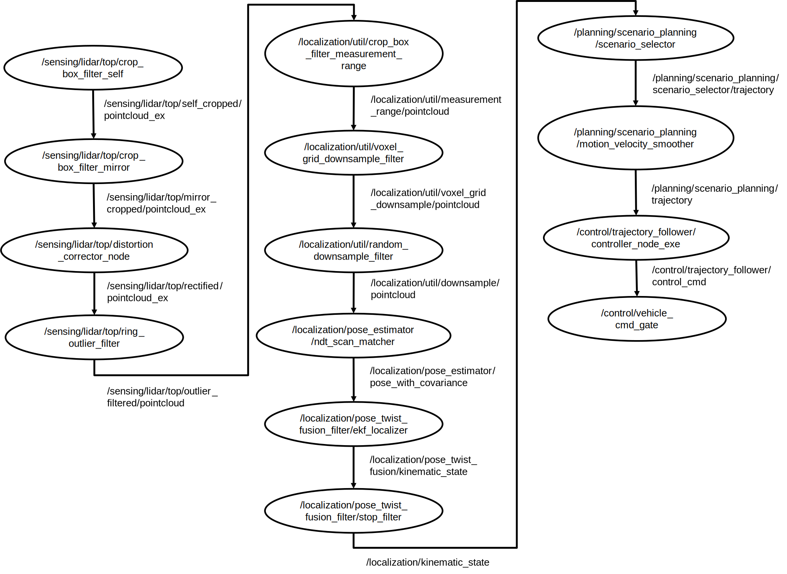

# tilde_early_deadline_detector

## Description

early_deadline_detector is for early deadline detection on the specified path.

early_deadline_detector can be built in [TILDE](https://github.com/tier4/TILDE/tree/master/doc) package.

## Requirement

- ROS 2 humble
- [TILDE](https://github.com/tier4/TILDE/tree/master/doc)
- TILDE enabled application
- The Messages should have the `header.stamp` field.

## The default path for early deadline detection

The default path is shown below.



## Code to be changed

If you want to change the path for early deadline detection, here is a set of the parts that should be changed in tilde_early_deadline_detector.cpp.

- line 66~: All pairs of topic names included in the path and accumulated execution time must be registered. The accumulated execution time means the sum of the execution time of topics and nodes from the topic to the end of the path. The accumulated execution time can be measured using [CARET]([https://github.com/tier4/TILDE/tree/master/doc](https://github.com/tier4/caret)).
- line 233~: All topic names and their MessageTrackingTags (topic) must be registered.
- line 374: The end of the path (topic) must be registered to measure end-to-end latency.

## Build

early_deadline_detector must be built in [TILDE/src](https://github.com/tier4/TILDE/tree/master/src).

Do `colcon build`. We recommend the "Release" build for performance.

```bash
colcon build --symlink-install --cmake-args -DCMAKE_BUILD_TYPE=Release
```

## Run

Use `ros2 run` as below.

```bash
$ source /path/to/ros/humble/setup.bash
$ source /path/to/TILDE/install/setup.bash
$ source install/setup.bash
$ ros2 run tilde_early_deadline_detector tilde_early_deadline_detector_node_exe \
    --ros-args --params-file src/tilde_early_deadline_detector/autoware_sensors.yaml
```

Here is a set of parameters.

| category          | name                     | about                                                                                          |
| ----------------- | ------------------------ | ---------------------------------------------------------------------------------------------- |
| system input      | `sensor_topics`          | regard nodes as sensors if MessageTrackingTag has no input_infos or the topic is in this list. |
| ignore            | `ignore_topics`          | don't subscribe these topics                                                                   |
| skip              | `skips_main_in`          | skip setting: input main topics                                                                |
|                   | `skips_main_out`         | skip setting: output main topic, in `skips_main_in` order                                      |
| target & deadline | `target_topics`          | the all topics included in the specified path.                                                 |
|                   | `deadline_ms`            | list of deadline [ms] in `target_topics` order.                                                |
| maintenance       | `expire_ms`              | internal data lifetime                                                                         |
|                   | `cleanup_ms`             | timer period to cleanup internal data                                                          |
| miscellaneous     | `clock_work_around`      | set true when your bag file does not have `/clock`                                             |
| debug print       | `show_performance`       | set true to show performance report                                                            |
|                   | `print_report`           | whether to print internal data                                                                 |
|                   | `print_pending_messages` | whether to print pending messages                                                              |

See [autoware_sensors.yaml](autoware_sensors.yaml) for a sample parameter yaml file.

## Notification

If the target topic overruns, `deadline_notification` topic is published.
The message type is [DeadlineNotification.msg](../tilde_msg/msg/DeadlineNotification.msg).
